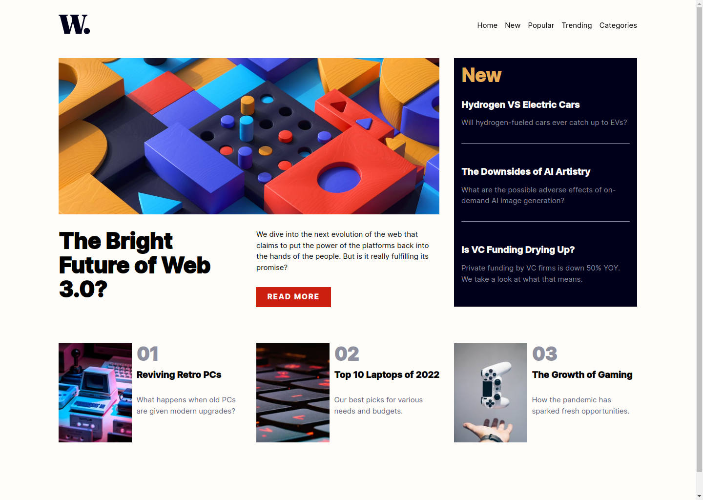

# Frontend Mentor - News homepage solution

This is a solution to the [News homepage challenge on Frontend Mentor](https://www.frontendmentor.io/challenges/news-homepage-H6SWTa1MFl). Frontend Mentor challenges help you improve your coding skills by building realistic projects.

## Table of contents

- [Overview](#overview)
  - [The challenge](#the-challenge)
  - [Screenshot](#screenshot)
  - [Links](#links)
- [My process](#my-process)
  - [Built with](#built-with)
  - [What I learned](#what-i-learned)
  - [Continued development](#continued-development)
  - [Useful resources](#useful-resources)
- [Author](#author)

**Note: Delete this note and update the table of contents based on what sections you keep.**

## Overview

### The challenge

Users should be able to:

- View the optimal layout for the interface depending on their device's screen size
- See hover and focus states for all interactive elements on the page
- **Bonus**: Toggle the mobile menu (requires some JavaScript)

### Screenshot



### Links

- Solution URL: [Github](https://github.com/rudimediaz/fem-news-homepage)
- Live Site URL: [Live Site](https://rudhifemnews.netlify.app/)

## My process

### Built with

- Semantic HTML5 markup
- CSS Cascade Layers
- CSS custom properties
- Flexbox
- CSS Grid
- Mobile-first workflow
- Postcss
- [Vite](https://vitejs.dev) - Bundler

### What I learned

- CSS Grid and Responsive Design

```css
.grid {
  display: grid;
}

.headline {
  flex-direction: column;
  grid-template-columns: repeat(2, minmax(15em, 1fr)) 1fr;
  grid-template-rows: repeat(3, minmax(80px, 1fr)) repeat(3, auto);
  gap: 2rem;
}
```

### Continued development

Handling images on different viewports

### Useful resources

- [CSS Grid Guide](https://developer.mozilla.org/en-US/docs/Web/CSS/CSS_Grid_Layout)

## Author

- Frontend Mentor - [@rudimediaz](https://www.frontendmentor.io/profile/rudimediaz)
- Twitter - [@rudimediaz](https://www.twitter.com/rudimediaz)
